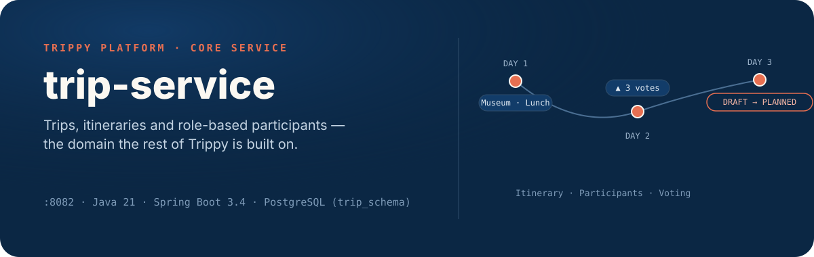
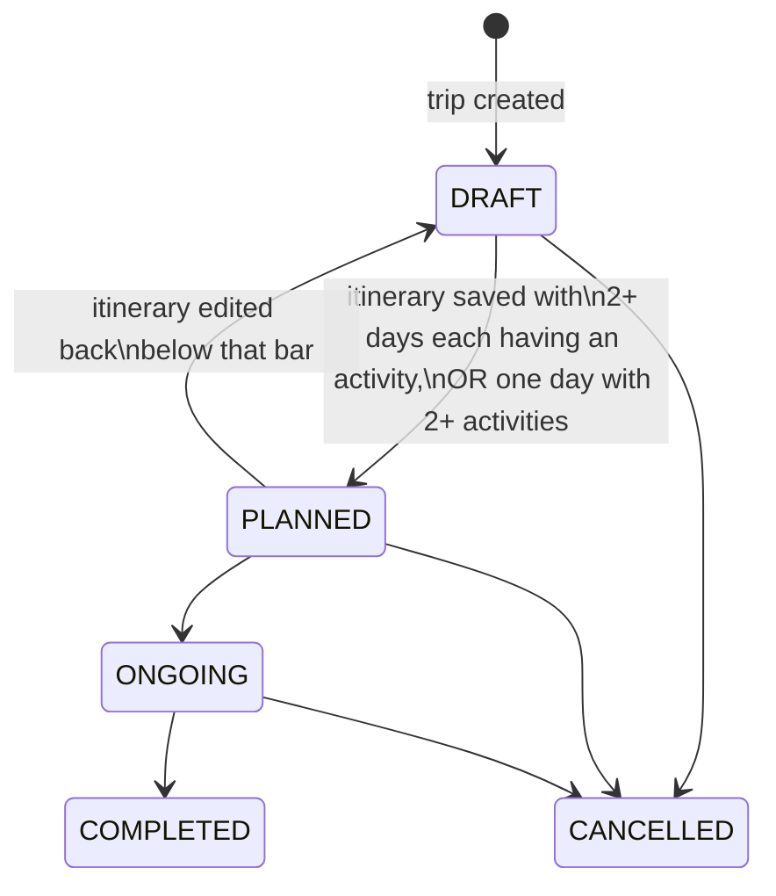
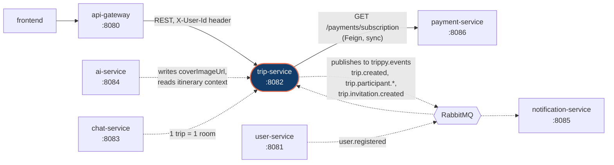

<p align="center">
  
</p>

<p align="center">
  <sub>
    <b>172</b> tests passing · <b>0</b> failures &nbsp;·&nbsp;
    <b>32</b> REST endpoints across <b>6</b> controllers &nbsp;·&nbsp;
    <b>8</b> domain events published
  </sub>
</p>

## What this service owns

`trip-service` is the collaborative core of Trippy. Every other service treats it as the source of truth for one question: **what is this trip, who's on it, and what does the plan look like right now?**

- **Trips** — create, update, cancel, and publish trips; enforce the free-plan trip limit via a live call to `payment-service`.
- **Itineraries** — day-by-day plans of activities (location, time window, category, cost & currency), replaced as a whole on every save.
- **Participants** — role-based membership (`OWNER` / `EDITOR` / `VIEWER` / `MEMBER`) with a full invite lifecycle: direct invite, invite-by-email (works even before the invitee has an account), join requests with owner approval, accept/decline, leave, kick.
- **Group voting** — participants vote on a whole day plan or on a single activity; owners/editors can enable voting, set a deadline, and freeze it.
- **Discovery** — a public feed of published trips, and a read-only shareable itinerary link that needs no authentication.

It does **not** generate itineraries (that's `ai-service`), send emails or push notifications (`notification-service`), or store chat history (`chat-service`) — it just owns the trip data those services react to.

## The mechanism worth knowing about

A trip is born as `DRAFT` and is **not shown to anyone outside its participants** — not in the public discovery feed, not via direct link, even if its visibility is set to `PUBLIC`. It's promoted to `PLANNED` automatically, the moment its itinerary becomes substantial enough to be worth showing:



This check re-runs on **every** itinerary save (`PUT /trips/{tripId}/itinerary`) — there's no separate "publish" action to remember, and no way to accidentally expose a half-empty trip to strangers. `ONGOING`, `COMPLETED`, and `CANCELLED` stay under explicit owner control via `PATCH /trips/{tripId}/status` and are never touched by this rule.

## Where it sits in the platform



`trip-service` calls out to `payment-service` synchronously (to check the caller's plan) and consumes `user.registered` from `user-service` asynchronously — the moment someone registers with an email that was invited to a trip while they had no account, they're linked in automatically. Every other service downstream (`notification-service`, `ai-service`) reacts to the events `trip-service` publishes rather than calling back into it.

<details>
<summary><b>Domain events</b> — exchange <code>trippy.events</code> (published) · <code>user.events</code> (consumed)</summary>

| Direction | Routing key | Fired when |
|---|---|---|
| ↗ publish | `trip.created` | A trip is created |
| ↗ publish | `trip.invitation.created` | A user is directly invited to a trip |
| ↗ publish | `trip.participant.invited` | An invite-by-email is sent |
| ↗ publish | `trip.participant.invite_proposed` | An invite is proposed for review |
| ↗ publish | `trip.participant.join_requested` | Someone requests to join a public trip |
| ↗ publish | `trip.participant.approved` | An owner approves a join request |
| ↗ publish | `trip.participant.declined` | An invite or join request is declined |
| ↗ publish | `trip.participant.joined` | A participant's status becomes `ACCEPTED` |
| ↙ consume | `user.registered` | A newly-registered user's email matches a pending invite — linked automatically via `PendingInviteLinkService` |

</details>

## API surface

All routes are mounted under `/trips` and expect an `X-User-Id` header — the API Gateway attaches this after validating the caller's JWT; `trip-service` trusts it rather than re-validating tokens itself.

<details open>
<summary><b>Trips</b> — <code>TripController</code></summary>

| Method | Path | Does |
|---|---|---|
| `POST` | `/trips` | Create a trip (enforces the 3-trip cap on the FREE plan) |
| `GET` | `/trips` | List the caller's trips, paginated |
| `GET` | `/trips/public` | Discovery feed — published `PUBLIC` trips, excludes the caller's own |
| `GET` | `/trips/{tripId}` | Trip detail — open for published `PUBLIC` trips, else participants only |
| `GET` | `/trips/shared/{tripId}` | Same, with no auth required, for share links |
| `PATCH` | `/trips/{tripId}` | Update trip fields (owner/editor) |
| `PATCH` | `/trips/{tripId}/status` | Explicit lifecycle transition (owner) |
| `DELETE` | `/trips/{tripId}` | Cancel a trip (owner) |

</details>

<details>
<summary><b>Itinerary</b> — <code>ItineraryController</code>, <code>SharedTripController</code></summary>

| Method | Path | Does |
|---|---|---|
| `GET` | `/trips/{tripId}/itinerary` | Fetch the current day-by-day plan |
| `PUT` | `/trips/{tripId}/itinerary` | Replace the whole itinerary; re-evaluates `DRAFT`⇄`PLANNED` |
| `GET` | `/trips/shared/{tripId}/itinerary` | Public, unauthenticated read for share links |

</details>

<details>
<summary><b>Participants</b> — <code>ParticipantController</code></summary>

| Method | Path | Does |
|---|---|---|
| `POST` | `/trips/{tripId}/participants/invite` | Invite an existing user by ID |
| `POST` | `/trips/{tripId}/participants/invite-by-email` | Invite by email, even without an account yet |
| `POST` | `/trips/{tripId}/participants/approve` | Approve a pending join request |
| `POST` | `/trips/{tripId}/participants/reject` | Reject a pending join request |
| `POST` | `/trips/{tripId}/participants/accept` | Accept an invite |
| `POST` | `/trips/{tripId}/participants/decline` | Decline an invite |
| `POST` | `/trips/{tripId}/participants/request-join` | Request to join a public trip |
| `DELETE` | `/trips/{tripId}/participants/leave` | Leave a trip |
| `GET` | `/trips/{tripId}/participants` | List participants |
| `GET` | `/trips/{tripId}/participants/{userId}` | Get one participant |
| `DELETE` | `/trips/{tripId}/participants/kick/{targetUserId}` | Remove a participant (owner/editor) |

</details>

<details>
<summary><b>Voting</b> — <code>VotingController</code></summary>

| Method | Path | Does |
|---|---|---|
| `POST` / `DELETE` | `/trips/{tripId}/itinerary/days/{dayNumber}/vote` | Cast / retract a day-plan vote |
| `GET` | `/trips/{tripId}/itinerary/days/{dayNumber}/votes` | Day-plan vote tally |
| `PUT` | `/trips/{tripId}/itinerary/voting-settings` | Enable/disable voting, set a deadline |
| `POST` / `DELETE` | `/trips/{tripId}/itinerary/activities/{activityId}/vote` | Cast / retract an activity vote |
| `GET` | `/trips/{tripId}/itinerary/activities/{activityId}/votes` | Activity vote tally |

</details>

<details>
<summary><b>Comments</b> — <code>ActivityCommentController</code></summary>

| Method | Path | Does |
|---|---|---|
| `GET` | `/trips/{tripId}/activities/{activityId}/comments` | List comments on an activity |
| `POST` | `/trips/{tripId}/activities/{activityId}/comments` | Add a comment |
| `DELETE` | `/trips/{tripId}/activities/{activityId}/comments/{commentId}` | Delete a comment |

</details>

Full request/response schemas live in [`contracts/tripServiceContract.yaml`](../../contracts/tripServiceContract.yaml), or browse them live once the service is running:

```
http://localhost:8082/swagger-ui.html
```

## Domain model

```
Trip ──┬── 0..* Participant        (role: OWNER · EDITOR · VIEWER · MEMBER)
       │                            (status: INVITED or PENDING_APPROVAL → ACCEPTED, DECLINED, or LEFT)
       └── 0..1 Itinerary
                 └── 1..* DayPlan ──┬── 0..* Activity ──┬── 0..* ActivityVote
                                    │                    └── 0..* ActivityComment
                                    └── 0..* DayPlanVote
```

Each `Activity` carries a `location`, a `startTime`/`endTime` window, an `ActivityCategory`, and an `estimatedCost` + `currency` — enough to answer "what are we doing, where, when, and how much" without a second lookup. The full field-level diagram lives in [`architecture/mo-v2.mmd`](../../architecture/mo-v2.mmd).

## Running it

```bash
# from the repo root — starts Postgres, RabbitMQ, Redis
cd infra/docker && docker compose up -d

# from the repo root — starts trip-service on :8082
./mvnw -pl services/trip-service spring-boot:run
```

The service reads its database and RabbitMQ credentials from `infra/docker/.env` (see `.env.example` for the required keys) and expects `trip_schema` to already exist — schema is managed by the SQL scripts under `infra/docker/init-scripts/postgres/`, not Flyway. `spring.jpa.hibernate.ddl-auto` is set to `validate`, so a schema drift shows up immediately as a startup error rather than a silent runtime failure.

## Testing

```bash
./mvnw -pl services/trip-service test
```

172 tests: Mockito-based unit tests for every service method, plus `@DataJpaTest` repository tests that run against a real H2 schema generated from the JPA entities — including foreign-key constraints — so cross-entity delete ordering and cascade behavior are verified against real constraints, not mocks.

## Tech stack

| | |
|---|---|
| Language / runtime | Java 21 |
| Framework | Spring Boot 3.4 (Web, Data JPA, Validation, AMQP, Actuator) |
| Database | PostgreSQL — schema `trip_schema` |
| Messaging | RabbitMQ (topic exchange `trippy.events`, consumes `user.events`) |
| Service-to-service | Spring Cloud OpenFeign → `payment-service` |
| API docs | springdoc-openapi / Swagger UI |
| Test stack | JUnit 5, Mockito, AssertJ, H2 (`@DataJpaTest`) |

## Related docs

- [`contracts/tripServiceContract.yaml`](../../contracts/tripServiceContract.yaml) — the OpenAPI contract
- [`architecture/mo-v2.mmd`](../../architecture/mo-v2.mmd) — full cross-service domain model
- [Root README](../../README.md) — how `trip-service` fits into the whole Trippy platform
